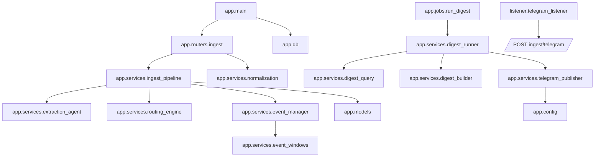

# Architecture

## architecture-overview

The system is a multi-process Python application with three primary runtimes:
1. **API process** (`FastAPI`): receives ingest payloads and executes the pipeline.
2. **Listener process** (`Telethon`): consumes Telegram messages and calls API ingest endpoint.
3. **Digest job process**: scheduled/ad-hoc runner that builds and publishes digest text.

Primary architecture style is **service-oriented modules inside a single backend codebase**:
- Router layer (`app/routers`) handles HTTP concerns.
- Service layer (`app/services`) handles extraction, routing, event upsert, and digest logic.
- Persistence layer (`app/models`, `app/db`) encapsulates ORM tables/session management.

Related docs: [Data Flow](../02-flows/DATA_FLOW.md), [API](../03-interfaces/API.md), [Deployment](../04-operations/DEPLOYMENT.md).

## entry-points

### HTTP/API entrypoints
- `app.main:create_app` creates FastAPI app and registers routes.
- `GET /health` inline handler in `create_app`.
- `POST /ingest/telegram` in `app.routers.ingest:ingest_telegram`.

### Process entrypoints
- API runtime: `uvicorn app.main:app`
- Listener runtime: `python -m listener.telegram_listener` -> `listener.telegram_listener:main`
- Digest runtime: `python -m app.jobs.run_digest` -> `app.jobs.run_digest:main`

## runtime-model

## runtime-api-process
On startup, FastAPI lifespan:
1. Configures logging.
2. Calls `init_db()` to create tables (`Base.metadata.create_all`).
3. Serves requests.

Per ingest request:
1. Normalize text.
2. Pipeline execution for idempotent raw insert, extraction, routing, event upsert.
3. Commit on success; rollback and HTTP 500 on any exception.

## runtime-listener-process
Long-lived Telethon client:
1. Reads required env vars.
2. Authenticates Telegram client.
3. Subscribes to `events.NewMessage` for configured source channel.
4. Builds ingest payload and posts to backend with retry/backoff.

## runtime-digest-job
Short-lived job:
1. Loads settings.
2. Initializes DB metadata.
3. Queries recent events.
4. Builds digest text.
5. Skips if duplicate hash exists in recent window.
6. Publishes to Telegram bot API and records `published_posts` row.

## module-dependency-graph

## configuration-model

## config-backend-settings
`app.config.Settings` (Pydantic settings):
- `database_url` (**required**).
- `api_host` (default `0.0.0.0`).
- `api_port` (default `8000`).
- `vip_digest_hours` (default `4`).
- `tg_bot_token` (optional, required for digest publish).
- `tg_vip_chat_id` (optional, required for digest publish).

Config source includes `.env` and process environment.

## config-listener-env
Listener hard-requires:
- `TG_API_ID`, `TG_API_HASH`, `TG_SESSION_NAME`, `TG_SOURCE_CHANNEL`, `INGEST_API_BASE_URL`.

## data-storage-model

Primary DB tables:
- `raw_messages`: canonical ingest records (idempotency key: channel + telegram message ID).
- `extractions`: structured extraction JSON per raw message.
- `routing_decisions`: routing flags/priority per raw message.
- `events`: canonical event entity keyed by fingerprint + time window matching.
- `event_messages`: many-to-many link between events and raw messages.
- `published_posts`: digest publish history with content hash for deduplication.

## external-integrations

| Integration | Where used | Purpose |
|---|---|---|
| Telegram MTProto via `Telethon` | `listener/telegram_listener.py` | Consume source channel messages. |
| Backend HTTP API via `httpx` | `listener/telegram_listener.py` | Forward listener payloads to `/ingest/telegram`. |
| Telegram Bot HTTP API (`api.telegram.org`) | `app/services/telegram_publisher.py` | Publish digest text to VIP chat/channel. |
| SQL database via SQLAlchemy engine | `app/db.py` + models/services | Persistent storage for pipeline state. |

## architecture-uncertainties

- No migration framework is present in code (for example Alembic), so schema evolution workflow is uncertain.
- No explicit production ASGI server/process manager config is present in repo, so deployment orchestration is inferred but not fully specified.
