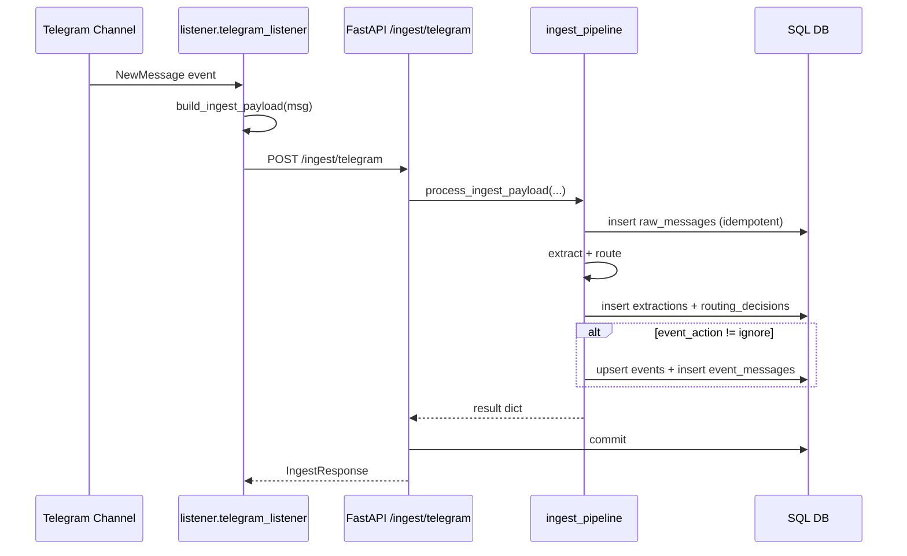

# Data Flow

## overview

This document describes runtime data flows derived from executable code paths.

## flow-1-telegram-message-to-event

### trigger
- Trigger/source: Telegram `events.NewMessage` in listener process.
- Code entrypoint: `listener.telegram_listener:handler`.

### steps
1. **Listener receives Telegram message**
   - Builds JSON payload with channel/message metadata and UTC timestamp.
   - Function: `build_ingest_payload`.
   - Input: Telethon message object.
   - Output: dict matching `TelegramIngestPayload` fields.
2. **Listener POSTs payload to backend with retries**
   - Function: `post_with_retries`.
   - Behavior: retries on exceptions, 429, and 5xx with exponential backoff up to 30s.
3. **API handler validates payload schema**
   - Endpoint: `POST /ingest/telegram`.
   - Pydantic model: `TelegramIngestPayload`.
4. **Normalize raw text**
   - Function: `normalize_message_text`.
   - Output: cleaned single-spaced text.
5. **Idempotent raw message insert**
   - Function: `process_ingest_payload`.
   - Checks existing `(source_channel_id, telegram_message_id)` before insert; also handles DB uniqueness race via `IntegrityError` fallback.
   - Persistence: `raw_messages` table.
6. **Extraction step**
   - Function: `ExtractionAgent.extract`.
   - Input: normalized text + message time + source channel name.
   - Output: `ExtractionJson` (topic, entities, impact, summary, event fingerprint, etc.).
   - Persistence: `extractions` table.
7. **Routing step**
   - Function: `route_extraction`.
   - Output: `RoutingDecisionData` including destination list, publish priority, and `event_action`.
   - Persistence: `routing_decisions` table.
8. **Event upsert step (if `event_action != ignore`)**
   - Function: `upsert_event`.
   - Matching strategy: `event_fingerprint` + topic/breaking-dependent time window.
   - Creates or updates `events` row and inserts `event_messages` link.
9. **Commit + response**
   - On success: returns `IngestResponse` with status and IDs.
   - On error: router rolls back session and responds with HTTP 500.

### persistence-side-effects
- Inserts/updates: `raw_messages`, `extractions`, `routing_decisions`, `events`, `event_messages`.
- Idempotency guard: unique constraint on `raw_messages(source_channel_id, telegram_message_id)`.

### error-handling-retries
- Listener: retry with exponential backoff on transient failures.
- API router: try/except around pipeline execution; rollback on failure.
- Pipeline: handles insert race via `IntegrityError` and returns duplicate response.

### observability
- Listener logs: `post_ok`, `post_retryable`, `post_nonretryable`, `post_error`, `post_failed`.
- API/pipeline logs: `ingest_ok`, `ingest_failed`, `pipeline_done`, `event_create`, `event_update`.

## flow-2-digest-generation-and-publication

### trigger
- Trigger/source: CLI job invocation `python -m app.jobs.run_digest`.

### steps
1. **Job setup**
   - `run_digest.main` loads settings, initializes DB, opens session.
2. **Event query by time window**
   - `get_events_for_digest(hours)` selects events updated/recent in last N hours.
3. **Digest text generation**
   - `build_digest(events, window_hours)` groups events by topic label and formats message.
4. **Digest dedup check**
   - `has_recent_duplicate(destination, content_hash, within_hours)` checks `published_posts`.
5. **Publish to Telegram bot API**
   - `send_digest_to_vip(text)` sends HTTP POST to `https://api.telegram.org/bot<TOKEN>/sendMessage`.
6. **Persist publication record**
   - Inserts `published_posts` row with hash and content.

### inputs-outputs
- Inputs: DB event rows + `VIP_DIGEST_HOURS` + Telegram bot credentials.
- Outputs: Telegram message side effect + persisted `published_posts` record + result dict.

### error-handling
- Missing Telegram bot config raises `RuntimeError`.
- Telegram API >= 400 logs error and raises HTTP error.
- Duplicate digest in recent window skips publish.

### observability
- Logs include: `digest_skip_duplicate`, `digest_published`, `telegram_publish_failed`, `telegram_publish_ok`.

## flow-3-health-check

### trigger
- `GET /health` HTTP call.

### steps
1. FastAPI route returns `HealthResponse(status="ok")`.

### side-effects
- No DB/API side effects.

## uncertainties
- No explicit queue/broker exists in code, so all flows are synchronous HTTP + DB operations.
- No tracing/metrics instrumentation is present; observability is log-based only.
