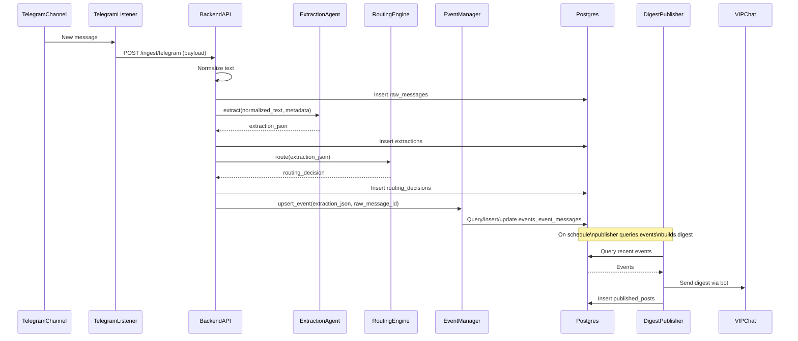

## Data Flow – Telegram Message to Storage and Outputs

### Purpose

Describe the end-to-end data flow for `telegram_message_to_storage_and_outputs` in Phase 1 MVP.

### Steps Overview

The flow consists of 8 steps:

1. **Ingest**
2. **Normalize**
3. **Extract (LLM / Stub)**
4. **Evidence (conditional, Phase 2+)**
5. **Route (logic gates)**
6. **Dedup / Event Upsert**
7. **Store**
8. **Publish (scheduled)**

### Step 1 – Ingest

- **Name**: Ingest
- **Input**: Telegram message + metadata from Telethon.
- **Process**:
  - Listener receives a new message from the configured channel.
  - Listener constructs payload:
    - `source_channel_id`
    - `source_channel_name`
    - `telegram_message_id`
    - `message_timestamp_utc`
    - `raw_text`
    - `raw_entities_if_available`
    - `forwarded_from_if_available`
  - Listener POSTs JSON payload to `/ingest/telegram`.
- **Output**:
  - Validated request passed to backend ingest pipeline.

### Step 2 – Normalize

- **Name**: Normalize
- **Input**: `raw_text` from ingest payload.
- **Process**:
  - Apply deterministic normalization:
    - Trim whitespace.
    - Collapse duplicate whitespace where safe.
    - Preserve numeric values and key tokens.
  - Result is `normalized_text`.
- **Output**:
  - `normalized_text` string added to raw message record.

### Step 3 – Extract (LLM / Stub)

- **Name**: Extract
- **Input**:
  - `normalized_text`
  - `message_timestamp_utc`
  - `source_channel_name`
- **Process**:
  - Call `ExtractionAgent` with inputs.
  - In Phase 1: use stub implementation that returns well-formed `extraction_json`.
  - Validate JSON against `llm_extraction_schema`.
- **Output**:
  - `extraction_json` stored in `extractions` table linked to the raw message.

### Step 4 – Evidence (Conditional, Phase 2+)

- **Name**: Evidence
- **Input**: `extraction_json`.
- **Process** (Phase 2+):
  - If:
    - `is_breaking == true`, OR
    - `impact_score >= 60`, OR
    - `topic` in `{macro_econ, war_security, credit}` AND `confidence >= 0.6`,
  - Then:
    - Call EvidenceAgent to perform web/news search.
    - Collect `evidence_sources`, `corroboration_status`, `reliability_score`.
- **Output**:
  - Evidence and reliability summary stored and attached to events.

### Step 5 – Route (Logic Gates)

- **Name**: Route
- **Input**:
  - `extraction_json`
  - (Optionally) evidence summary in later phases.
- **Process**:
  - Apply hard-coded or config-driven rules to determine:
    - Destinations (`store_to`).
    - `publish_priority` (`none`, `low`, `medium`, `high`).
    - `requires_evidence` (boolean).
    - `event_action` (`create`, `update`, `ignore`).
    - `flags` (e.g., `unconfirmed`, `high_impact`, `country_specific`).
- **Output**:
  - `routing_decision` stored in `routing_decisions` table, linked to raw message.

### Step 6 – Dedup / Event Upsert

- **Name**: Dedup / Event Upsert
- **Input**:
  - `extraction_json` (includes `event_fingerprint`, `topic`, `event_time`, `is_breaking`).
  - `routing_decision.event_action`.
- **Process**:
  - Compute time window using:
    - `default_hours = 24`
    - `breaking_hours = 6`
    - `macro_econ_hours = 48`
  - Search for events with same `event_fingerprint` within window.
  - If match found:
    - Update existing event fields (summary, impact, etc.).
    - Link raw message via `event_messages`.
  - If no match:
    - Create new event from extraction.
    - Link raw message via `event_messages`.
- **Output**:
  - `event_id` and `event_update_log` implied by logs and DB state.

### Step 7 – Store

- **Name**: Store
- **Input**:
  - Raw message, extraction, routing decision, event data.
- **Process**:
  - Persist:
    - `raw_messages` (immutable).
    - `extractions` (per message).
    - `events` (canonical).
    - `event_messages` (links).
    - `routing_decisions`.
  - Ensure idempotent behavior and uniqueness constraints.
- **Output**:
  - Queryable archive for later retrieval and analytics.

### Step 8 – Publish (Scheduled)

- **Name**: Publish
- **Input**:
  - Events in a given time window (default 4 hours).
- **Process**:
  - Periodic job:
    - Queries events updated in last `VIP_DIGEST_HOURS`.
    - Groups by topic.
    - Builds digest text using PublisherAgent template.
    - Sends digest via Telegram bot to VIP chat.
    - Records digest in `published_posts`.
- **Output**:
  - `published_posts` records with content and audit trail.

### Sequence Diagram

## Phase 2 Addendum – Scheduled Extraction Processing (10-minute cadence)

This addendum narrows Phase 2 scope to scheduled backend extraction for already-ingested `raw_messages`.

### Scope

- Read stored Telegram messages every 10 minutes.
- Select only eligible, not-yet-completed messages.
- Run `ExtractionAgent` prompt flow using:
  - `normalized_text`
  - `message_time`
  - `source_channel_name`
- Validate strict JSON response against extraction contract.
- Persist validated extraction with idempotency and traceability.

### Eligibility and Retry Model

- Eligibility is based on processing state (`pending|failed|in_progress lease expired`) and absence of `completed` state.
- Selection order is deterministic (`message_timestamp_utc`, then `raw_messages.id`).
- Re-runs do not duplicate extraction rows for the same `raw_message_id`.
- Failed rows remain visible with error reason and are retryable in subsequent runs.

### Persistence Expectations

- `event_fingerprint` from validated extraction is stored unchanged and used as canonical dedup key downstream.
- Processing state records include attempt counters, lease timeout, run ID, and latest error.
- Extraction rows include traceability fields (`prompt_version`, model metadata, and raw LLM response/audit payload).

### Out of Scope for This Phase 2 Slice

- EvidenceAgent, RoutingAgent, and PublisherAgent feature expansion.
- Changes to Phase 1 listener ingestion contract except minimal dependencies.
