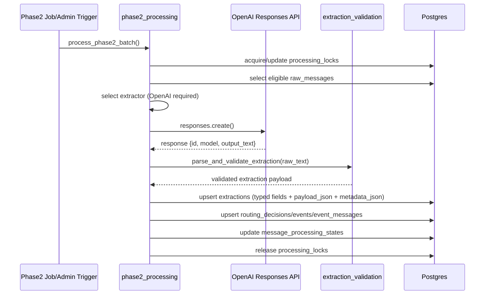

# Phase 2 Extraction Flow

## Purpose

Describe the implemented Phase 2 extraction pipeline for OpenAI-backed extraction and retrieval-oriented persistence.

## End-to-End Flow

1. Scheduler or admin trigger starts phase2 run (`python -m app.jobs.run_phase2_extraction` or admin endpoint).
2. Service acquires `processing_locks` row lease (`phase2_extraction` lock name).
3. Eligible rows are selected from `raw_messages` + `message_processing_states`:
   - no state row, or
   - `pending`, or
   - `failed`, or
   - expired `in_progress` lease.
4. Extractor selection:
   - If `PHASE2_EXTRACTION_ENABLED=true` and `OPENAI_API_KEY` present:
     - use `extract-and-score-openai-v1`.
   - Otherwise:
     - fail fast (no silent stub fallback).
5. Prompt is rendered from message text and metadata.
6. OpenAI Responses API is called.
7. Model output is parsed and strictly validated via pydantic schema validators.
8. On success, `extractions` row is inserted/updated with:
   - typed query fields (`topic`, `event_time`, `impact_score`, `confidence`, `sentiment`, `is_breaking`, `breaking_window`, `event_fingerprint`)
   - canonical `extractor_name`
   - full payload in `payload_json`
   - provider telemetry in `metadata_json`
9. Routing decision is computed and persisted.
10. Event upsert runs when `event_action != ignore`.
11. Message state is marked `completed`; otherwise `failed` with classed reason.

## Failure Policy

- Validation failure: mark processing state failed (`validation_error:*`), no stub substitution.
- Provider failure: mark processing state failed (`provider_error:*`), no stub substitution.
- Persistence failure: mark processing state failed (`persistence_error:*`).

## Sequence Diagram

