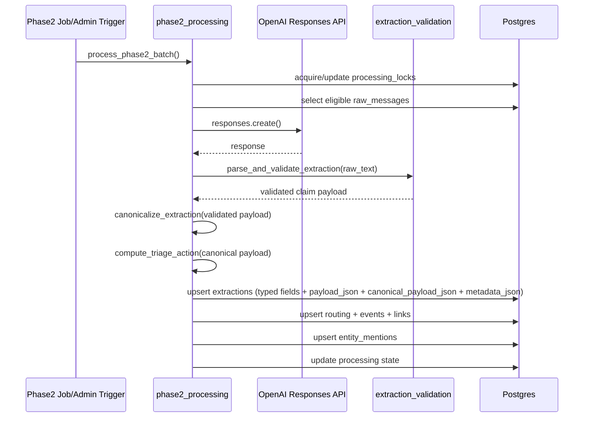

# Phase 2 Extraction Flow

## Purpose

Describe phase2 extraction as the stage that turns normalized wire bulletins into validated structured claim records and drives deterministic downstream processing.

## Phase Location in Full Pipeline

Phase2 extraction sits at the Stage 3-5 boundary:
- Stage 3: AI claim extraction
- Stage 4: deterministic triage/routing
- Stage 5: event clustering

## Current Implementation Flow

1. Trigger
- Job trigger: `python -m app.jobs.run_phase2_extraction`
- Optional admin trigger: `POST /admin/process/phase2-extractions`

2. Selection
- Acquire lock (`processing_locks`).
- Select eligible rows from `raw_messages` + `message_processing_states` (`pending`, `failed`, expired lease).

3. Extraction
- Use extractor `extract-and-score-openai-v1`.
- Call OpenAI Responses API.
- Parse and strictly validate JSON schema.
- Prompt template version: `extraction_agent_v2` (with `v1` kept unchanged for reproducibility).

4. Persistence
- Write typed extraction fields for retrieval.
- Write raw validated payload in `payload_json`.
- Write deterministic canonicalized payload in `canonical_payload_json`.
- Write provider/processing telemetry in `metadata_json`.

5. Downstream deterministic processing
- Canonicalize entities/source values deterministically.
- Compute deterministic triage output (`archive|monitor|update|promote`) and routing output.
- Create/update event clusters.
- Index entities to `entity_mentions` for retrieval-ready query paths.
- Mark processing state `completed` or `failed`.

## Consumes / Produces

### Consumes
- `raw_messages.normalized_text`
- `raw_messages.message_timestamp_utc`
- `raw_messages.source_channel_name`
- phase2 runtime config and prompt template

### Produces
- `extractions` row updates/inserts
- `routing_decisions` row updates/inserts
- `events` and `event_messages` updates
- `entity_mentions` updates
- `message_processing_states` status transitions
- phase2 run logs with summary counts

## Safe Rerun Behavior and Idempotency Boundaries

- Raw messages are immutable and not rewritten by phase2 extraction.
- Completed rows are skipped by eligibility logic unless state is reset.
- Reprocessing derived layers can be done by clearing non-raw tables and rerunning extraction.
- Full schema reset is destructive and should be used only for dev reset scenarios.

Reprocess commands:
- preserve raw: `CONFIRM_CLEAR_NON_RAW=true python -m app.jobs.clear_all_but_raw_messages`
- full reset: `CONFIRM_RESET_DEV_SCHEMA=true python -m app.jobs.reset_dev_schema`

## Claim Semantics and Uncertainty Preservation

- Extraction captures what the bulletin reports.
- Attribution/uncertainty language should remain represented in extraction output.
- `confidence` = extraction certainty.
- `impact_score` = face-value significance of the reported claim.
- Neither field is a truth-confirmation score.

## Failure Policy

- Validation error -> `failed` state (`validation_error:*`).
- Provider error -> `failed` state (`provider_error:*`).
- No silent fallback that rewrites output as a confirmed fact.

## Sequence Diagram

