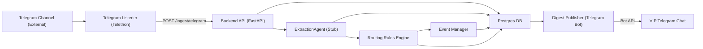

## Architecture Overview – Civicquant Intelligence Pipeline

### Purpose

Provide a concise, LLM-friendly overview of the Civicquant Intelligence Pipeline architecture for Phase 1 MVP.

### Scope

- Covers: components, responsibilities, data stores, and external integrations.
- Focuses on Phase 1 MVP capabilities.

### Components

- **Telegram Listener (MTProto user client)**
  - Technology: Python + Telethon.
  - Responsibility: Listen to one external Telegram channel and POST messages to the backend ingest endpoint.

- **Backend API (FastAPI)**
  - Technology: Python + FastAPI.
  - Responsibility: Accept ingest requests, normalize text, run extraction and routing, perform event dedup/upsert, and persist data.

- **Extraction Service (ExtractionAgent)**
  - Technology: Python service (stubbed logic in Phase 1).
  - Responsibility: Convert normalized text into structured extraction JSON using `llm_extraction_schema`.

- **Routing + Rules Engine**
  - Technology: Python module with config-driven rules.
  - Responsibility: Apply hard routing rules to extraction outputs, producing `routing_decision` objects.

- **Dedup + Event Manager**
  - Technology: Python module.
  - Responsibility: Match messages to existing events using `event_fingerprint` and time windows; update or create canonical events and link messages.

- **Storage Layer (Postgres)**
  - Technology: Postgres with SQLAlchemy ORM.
  - Responsibility: Store raw messages, extractions, events, routing decisions, and published posts.

- **Publisher (Digest Generator + Telegram Bot)**
  - Technology: Python + Telegram Bot API.
  - Responsibility: Query events over 4-hour windows, generate digests, and send them to VIP Telegram chat.

### High-Level Data Stores

- **Postgres tables (Phase 1)**
  - `raw_messages` – immutable ingested messages.
  - `extractions` – per-message extraction JSON and model metadata.
  - `events` – canonical events that aggregate related messages.
  - `event_messages` – join table linking messages to events.
  - `routing_decisions` – per-message routing outcomes.
  - `published_posts` – records of digests (and future posts) with content hashes.

### Non-Functional Requirements (Summary)

- **Accuracy over speed**: Prioritize accurate, auditable outcomes.
- **Latency**: Target ≤ 30 seconds end-to-end for ingest to processed state.
- **Idempotency**: No duplicate raw messages for same Telegram IDs; deterministic event dedup.
- **Safety and brand**:
  - No trading advice or prescriptive language.
  - Clear labeling of uncorroborated items (future phase for evidence).

### Architecture Diagram

